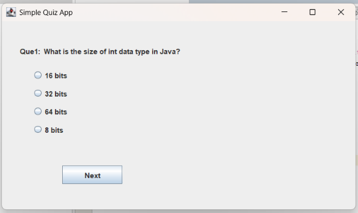
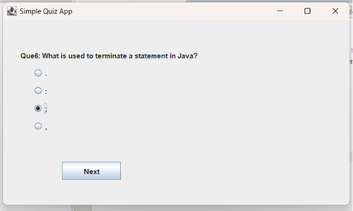
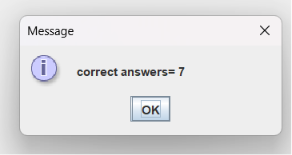

# 🎯 Java Quiz Application

## 📖 Description

A desktop-based Quiz Application developed using Java Swing and Maven. Users can answer multiple-choice questions and view their final score.

---

## ✨ Features

- Multiple Choice Questions
- Java Swing GUI
- Next Button
- Score Calculation
- Result Display

---

## 🛠 Technologies Used

- Java
- Java Swing
- Maven
- Git
- GitHub

---

## 🚀 How to Run

1. Clone the repository.

```
git clone https://github.com/Dharshinie1705/Java-Quiz-Application.git
```

2. Open the project in Apache NetBeans.

3. Run:

```
Quizapplication.java
```

or

```
java -jar quizapplication-1.0-SNAPSHOT.jar
```

---

## 👩‍💻 Author

**Dharshini E**

GitHub:
https://github.com/Dharshinie1705

## 📸 Screenshots

### Home Screen



### Quiz Screen



### Result Screen


